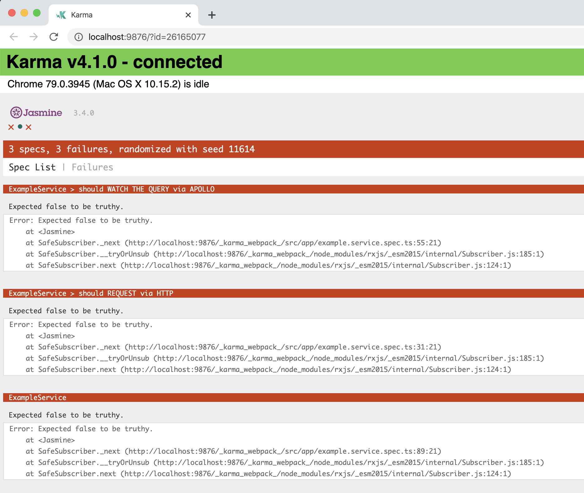

# AngularApolloTestingExample

This project was generated with [Angular CLI](https://github.com/angular/angular-cli) version 8.3.19.

## Bug Information

Examples and more details can be found in [example.service.spec.ts](src/app/example.service.spec.ts).

The documentation for testing Apollo states that `ApolloTestingController` works like `HttpTestingController` to test network responses by flushing fake data. This is true, `http.get` and `apollo.watchQuery` work exactly the same. You can test whether the responses are the expected responses without worrying about asynchronous factors, like using `async` or `fakeAsync` or `done`.

When using `apollo.query` or `apollo.mutate` it does not seem to work the same way and results in strange behavior when expectations do fail. Tests actually pass when they shouldn't, instead errors are thrown later after all tests are run without signaling what test caused a failure ("An error was thrown in afterAll").

The issue looks like `apollo.query` and `apollo.mutate` tests need to be handled using asynchronous testing APIs, like `fakeAsync` or `done`.

So is this expected? Why does `apollo.query` and `apollo.mutate` act differently than `http.get` and `apollo.watchQuery` when flushing results?

## Reproduce

Run `ng test` () to execute the unit tests via [Karma](https://karma-runner.github.io).

All the tests are programmed to fail intentionally with `expect(false).toBeTruthy()` in the subscription callback where the responses are received. Normally that is the place to check whether the data that was flushed is the data that was received like in Angular and Apollo testing documentation.

Result:
"Chrome 79.0.3945 (Mac OS X 10.15.2): Executed 3 of 3 (2 FAILED) ERROR (0.071 secs / 0.057 secs)"

## Resources

https://angular.io/guide/http#expecting-and-answering-requests
https://www.apollographql.com/docs/angular/guides/testing/

